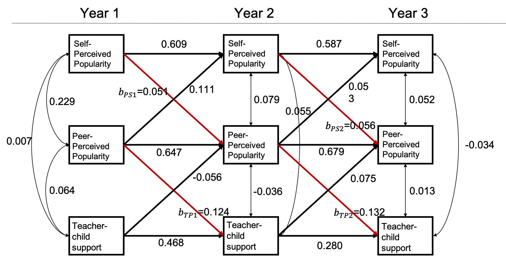

```{r setup, include = FALSE}
knitr::opts_chunk$set(
  collapse = TRUE,
  comment = "#>"
)
```

<!-- -->
In this vignette we will demonstrate how to use `simPM` to search for an optimal PHPM design for a longitudinal research study that employs an utoregressive and cross-lagged model.

## <span style="color:seagreen">**Research Scenario**</span> 

Suppose a group of researchers is interested in examining the longitudinal reciprocal relations between peer relationships and teacher-child relationships. They have been funded for a longitudinal panel study following 1000 children for three years. Each year they would collect data on three measures: two measures of peer relationships (self-perceived popularity and peer-perceived popularity) and one measure of teacher-child relationships (teacher-child support). Upon the completion of data collection, they plan to fit an autoregressive cross-lagged model shown below. The parameter of focal interest to the researchers are the cross-lagged path coefficients predicting the peer-perceived popularity from the self-perceived popularity measured at the previous time point, as well as in the cross-lagged paths predicting teacher-child support from the peer-perceived popularity measured at the previous time point (marked in red). 

Unfortunately, after the first wave of data collection, the funding agency announces a 30% reduction in the remaining funding. The researcher wishes to continue the project under the budget constraint, with the hope to not compromise the scientific rigor and statistical power. The reseacher thus decideds to use `simPM` to find a design that yields sufficient power but costs no more than the reduced budget. 


```{r,out.width='50%', fig.align='center', fig.cap='An autoregressive and cross-lagged model', echo=FALSE}

```

## <span style="color:seagreen">**Spcify the Population and Analysis Model**</span> 

Because `simPM` searches for an optimal design based on power analysis using Monte Carlo simulations, it is thus required to supply a population model and analysis model. The easiest way to specify the population model and analysis model is to use the [`lavaan` model syntax](http://lavaan.ugent.be/tutorial/syntax1.html). For this example, the population model is specified as follows:

```{r,eval=F}
popModel <- '


SelfPop2~0.609*SelfPop1+0.111*PeerPop1
SelfPop3~0.587*SelfPop2+0.053*PeerPop2

PeerPop2~0.051*SelfPop1+0.647*PeerPop1+(-0.056)*Support1
PeerPop3~0.056*SelfPop2+0.679*PeerPop2+0.075*Support2

Support2~0.468*Support1+0.124*PeerPop1
Support3~0.280*Support2+0.132*PeerPop2

PeerPop1~~0.229*SelfPop1+0.064*Support1
SelfPop1~~0.007*Support1

PeerPop2~~0.079*SelfPop2+(-0.036)*Support2
SelfPop2~~0.055*Support2

PeerPop3~~0.052*SelfPop3+0.013*Support3
SelfPop3~~(-0.034)*Support3


#means
PeerPop1~3.273*1
SelfPop1~0.048*1
Support1~2.905*1

PeerPop2~1.247*1
SelfPop2~(-0.343)*1
Support2~1.193*1

PeerPop3~0.814*1
SelfPop3~(-0.161)*1
Support3~1.451*1

#variances

PeerPop1~~0.447*PeerPop1
SelfPop1~~1.010*SelfPop1
Support1~~0.540*Support1

PeerPop2~~0.238*PeerPop2
SelfPop2~~0.607*SelfPop2
Support2~~0.432*Support2

PeerPop3~~0.211*PeerPop3
SelfPop3~~0.380*SelfPop3
Support3~~0.424*Support3

'
```

The analysis model is specified as the same autoregressive and cross-lagged model but with freely estimated model parameters:

```{r, eval=F}
analyzeModel <- '

SelfPop2~SelfPop1+PeerPop1
SelfPop3~SelfPop2+PeerPop2

PeerPop2~SelfPop1+PeerPop1+Support1
PeerPop3~SelfPop2+PeerPop2+Support2

Support2~Support1+PeerPop1
Support3~Support2+PeerPop2

PeerPop1~~SelfPop1+Support1
SelfPop1~~Support1

PeerPop2~~SelfPop2+Support2
SelfPop2~~Support2

PeerPop3~~SelfPop3+Support3
SelfPop3~~Support3


#means
PeerPop1~1
SelfPop1~1
Support1~1

PeerPop2~1
SelfPop2~1
Support2~1

PeerPop3~1
SelfPop3~1
Support3~1

#variances

PeerPop1~~PeerPop1
SelfPop1~~SelfPop1
Support1~~Support1

PeerPop2~~PeerPop2
SelfPop2~~SelfPop2
Support2~~Support2

PeerPop3~~PeerPop3
SelfPop3~~SelfPop3
Support3~~Support3

'

```


## <span style="color:seagreen">**Wave-level PHPM Designs**</span> 
### <a name="wave">1. Search for an Optimal Wave-level Design</a>

We can use the main function `simPM()` to search for an optimal [wave-level missing design](). For `simPM()` to work properly, we need to supply the relevant information about this longitudinal study. By running the following code, `simPM` will automatically map out all the possible wave-level PHPM designs, run power analysis for each plausible design, and output the optimal design. 


```r
wave.ex3 <- simPM(popModel = popModel,                               #supply the population model using lavaan syntax
                  analyzeModel = analyzeModel,                       #supply the analysis model using lavaan syntax
                  VarNAMES = c("PeerPop1","SelfPop1","Support1",
                               "PeerPop2","SelfPop2","Support2",
                               "PeerPop3","SelfPop3","Support3"),    #the observed variable names, grouped in waves, in chronological order
                  distal.var = NULL,                                 #specify any distal variables that are not subject to planned missingness
                  n = 1000,                                          #original sample size
                  nreps = 1000,                                      #number of replications for Monte Carlo simulation
                  seed = 1234,                                       #random seed
                  Time = 3,                                          #total number of waves
                  k = 3,                                             #number of observed variables collected at each wave
                  Time.complete = 1,                                 #number of waves completed before funding cut occurs
                  costmx = c(5, 5, 5, 10, 10, 10),                   #unit cost of each data point at the following waves
                  pc = 0.1,                                          #percentage of participants to provide complete data after funding cut
                  pd = 0,                                            #percentage of participants to provide no data after funding cut
                  focal.param=c("PeerPop2~SelfPop1",
                                "Support2~PeerPop1",
                                "PeerPop3~SelfPop2",
                                "Support3~PeerPop2"),                #specify the focal parameters, using lavaan syntax
                  eval.budget = T,                                   #whether or not there is a budget restriction
                  rm.budget = 45*1000*0.7,                           #the amount of remaining available budget
                  complete.wave = NULL,                              #specify any future wave that need complete data to be collected
                  engine = "l",                                      #use lavaan and simsem to fit the models
                  methods = "wave"                                    #type of PHPM designs under consideration, "wave" indicates wave-level missing
                  )


```


More specifically:

* `VarNAMES = c("PeerPop1","SelfPop1","Support1", "PeerPop2","SelfPop2","Support2","PeerPop3","SelfPop3","Support3")`: The observed variables collected in this study are named <span style="color:firebrick">F1-F4, T1-T4, and M1-M4</span>.
* `Time = 4`: The study has <span style="color:firebrick">4</span> waves of data collection in total.
* `Time.complete = 1`: <span style="color:firebrick">One</span> wave of data collection has been completed before funding cut occurs
* `k = 3`: <span style="color:firebrick">Three</span> observed variable are collected at each wave of data collection. 
* `pc = 0.1`: <span style="color:firebrick">Ten percent</span> of the participants are randomly assigned to provide complete data for future waves after funding cut.
* `pd = 0`: <span style="color:firebrick">Zero percent</span> of the participants are assigned to drop from the study.
* `costmx = c(rep(5,3), rep(10,3), rep(15,3))`: The unit cost of collecting one report from the father, the mother, or the teacher is  <span style="color:firebrick">\$5</span> at wave 2, <span style="color:firebrick">\$10</span> at wave 3, and <span style="color:firebrick">\$15</span> at wave 4.  
* `n = 1135`: The original sample size planned was <span style="color:firebrick">1,135</span>.
* `nreps = 1000`: The program will run <span style="color:firebrick">1000</span> replications for Monte Carlo simulation (for each plausible design).
* `focal.param = c("interc~1", "slope~1", "interc~~interc", "slope~~slope")`: The focal parameters of interest are the mean and variance of the latent intercept and slope for the latent construct of externalizing behaviors.
* `complete.wave = NULL`: No future waves are by design to have complete data colleted from all of the three sources.
* `eval.budget = T`: Yes, there is a budget restriction that needs to be taken into consideration.
* `rm.budget = 90*1135*0.7`: After the funding cut, the researcher will have <span style="color:firebrick"> $\$71,505$ </span> $(=90\times1135\times0.7)$ to support the future waves of data collection.
* `distal.var = NULL`: There are no distal variables in the model that are not subject to repeated measures.
* `engine = "l"`: Data were simulated using `simsem` and the models were fitted using `lavaan`.
* `methods = "wave"`: Search for wave-level missing designs.


### 2. Summarize the Result


```{r, echo = FALSE, message = FALSE, warning = FALSE}
setwd("C:/Users/yifeng94/Desktop/simPM/simPM-git/examples")
load("linear_LGM_example.rda")
library(simPM)
```


To [view a summary of the results](), we can use the `summary()` function. It prints out the comparison among all the plausible wave-level missing designs (with regard to the parameter with the lowest empirical power), the optimal design that was selected, the details about the focal parameters for the selected optimal design, the missing data pattern for the selected optimal PHPM design, and the proportion as well as the number of participants assigned to each unqie missing data pattern.
```{r, eval=FALSE}
summary(wave.ex2)
``` 

For this example, there is only one possible wave-level PHPM design given the budget constraints. Therefore, the program has run simulations only for this one possible design. This design costs \$4,530, which is below the reduced available budget.

```r
[1] "=================results summary================"
  convergence.rate weakest.param.name weakest.para.power cost.design miss.waves
1             0.92               s~~s              0.999        4530          2
[1] "=================Optimal design================="
  convergence.rate weakest.param.name weakest.para.power cost.design miss.waves
1             0.92               s~~s              0.999        4530          2
```

With this design, 20% of the participants are assigned to provide complete data across all the future waves of data collection. The rest 80% of the participants are randomly assigned to one of the three unique missing data patterns ($n=86$ in each pattern). 


```r
[1] "=================Optimal patterns==============="
           se1 se2 se3 se4
             0   1   1   0
             0   1   0   1
             0   0   1   1
completers   0   0   0   0
[1] "=================Optimal probs=================="
[1] 0.266667 0.266667 0.266667 0.200000
[1] "=================Optimal ns===================="
[1] 86 86 86 65

```
Over 1000 replications, this design yields an empirical power of 0.999 for testing the slope variance $\sigma^2_\beta$, and 1 for testing the mean intercept ($\mu_\alpha$), the mean slope ($\mu_\beta$), and the intercept variance ($\sigma^2_\alpha$).


```r

[1] "=================Optimal design for focal parameters================="
     Estimate Average Estimate SD  Average SE Power (Not equal 0)   Std Est   Std Est SD
i~1        2.98293751 0.031715239 0.031616120               1.000 5.8125191 3.214384e-01
s~1        0.08626832 0.012315538 0.011890850               1.000 0.5821286 1.071983e-01
i~~i       0.26565608 0.028395191 0.027694967               1.000 1.0000000 1.479881e-16
s~~s       0.02275121 0.004702874 0.004540174               0.999 1.0000000 1.476542e-16
     Std Ave SE Average Param  Average Bias Coverage Average FMI1    SD FMI1
i~1   0.3109336         2.983 -6.248508e-05    0.945   0.06909154 0.02634767
s~1   0.1017555         0.086  2.683187e-04    0.939   0.33360543 0.03811522
i~~i  0.0000000         0.268 -2.343916e-03    0.935   0.25362176 0.04437375
s~~s  0.0000000         0.023 -2.487868e-04    0.939   0.62234904 0.04767489

```

<!--&nbsp;-->

To view more details of the optimal PHPM design, we can use the following code, which will print out the detailed model fitting results over the replications.
```{r,eval=FALSE}
summary(wave.ex2$opt.output)
```


### 3. Visualize the Optimal Design 

To [visualize the missing data patterns of the optimal PHPM design](), we can use the `plotPM()` function. It will plot the missing data pattern matrix so people can have a more intuitive understanding of the optimal design that was selected. In this plot, each row represents a unique missing data pattern. Each column represents an observed variable. The number of participants assigned to each missing data pattern is also labeled. 

```{r,fig.width=7,fig.height=4}
plotPM(wave.ex1, labels = F)
```


## <span style="color:seagreen">**Balanced Item-level PHPM Designs**</span> 
### 1. Search for an Optimal Wave-level Design {#item}

We can also use the function `simPM()` to search for an optimal [item-level missing design](). The code to search for optimal item-level PHPM designs is very similar to the code to search for optimal wave-level PHPM designs. The minor differences in the code are followed with comments.  

```r
item.ex2 <- simPM(
  popModel,
  analyzeModel,
  VarNAMES = c("F1","T1","M1","F2","T2","M2",
               "F3","T3","M3","F4","T4","M4"),
  distal.var = NULL,
  n = 1135,
  nreps = 1000,
  seed = 12345,
  Time = 4,
  k = 3,
  Time.complete = 1,
  costmx = c(5,5,5,10,10,10,15,15,15), 
  pc = 0.1,
  pd = 0,
  focal.param = c("interc~1",
                  "slope~1",
                  "interc~~interc",
                  "slope~~slope"),
  eval.budget = T,          
  rm.budget = 90*1135*0.7,        
  complete.var = NULL,            # specify any observed variables that need complete data to be collected in the future waves
  engine = "l",
  methods = "item"                # type of PHPM designs under consideration, "item" indicates item-level missing
)

```


While most of the arguments are the same as in the case of [wave-level missing designs](#wave), there are two arguments that are a little bit different in the context of item-level missing designs:


* `complete.var = NULL`: No observed variables are by design to have complete data colleted from all participants in the future waves of data collection.
* `methods = "item"`: Search for item-level missing designs.


### 2. Summarize the Result


```{r, echo = FALSE, message = FALSE, warning = FALSE}
setwd("C:/Users/yifeng94/Desktop/simPM/simPM-git/examples")
load("linear_LGM_example.rda")
library(simPM)
```


Similarly, to [view a summary of the results](), we can use the `summary()` function. 
```{r, eval=FALSE}
summary(item.ex2)
``` 

For this example, there is only one possible wave-level PHPM design given the budget constraints. Therefore, the program has run simulations only for this one possible design. This design costs \$4,530, which is below the reduced available budget.

```r
[1] "=================results summary================"
  convergence.rate weakest.param.name weakest.para.power cost.design miss.waves
1             0.92               s~~s              0.999        4530          2
[1] "=================Optimal design================="
  convergence.rate weakest.param.name weakest.para.power cost.design miss.waves
1             0.92               s~~s              0.999        4530          2
```

With this design, 20% of the participants are assigned to provide complete data across all the future waves of data collection. The rest 80% of the participants are randomly assigned to one of the three unique missing data patterns ($n=86$ in each pattern). 


```r
[1] "=================Optimal patterns==============="
           se1 se2 se3 se4
             0   1   1   0
             0   1   0   1
             0   0   1   1
completers   0   0   0   0
[1] "=================Optimal probs=================="
[1] 0.266667 0.266667 0.266667 0.200000
[1] "=================Optimal ns===================="
[1] 86 86 86 65

```
Over 1000 replications, this design yields an empirical power of 0.999 for testing the slope variance $\sigma^2_\beta$, and 1 for testing the mean intercept ($\mu_\alpha$), the mean slope ($\mu_\beta$), and the intercept variance ($\sigma^2_\alpha$).


```r

[1] "=================Optimal design for focal parameters================="
     Estimate Average Estimate SD  Average SE Power (Not equal 0)   Std Est   Std Est SD
i~1        2.98293751 0.031715239 0.031616120               1.000 5.8125191 3.214384e-01
s~1        0.08626832 0.012315538 0.011890850               1.000 0.5821286 1.071983e-01
i~~i       0.26565608 0.028395191 0.027694967               1.000 1.0000000 1.479881e-16
s~~s       0.02275121 0.004702874 0.004540174               0.999 1.0000000 1.476542e-16
     Std Ave SE Average Param  Average Bias Coverage Average FMI1    SD FMI1
i~1   0.3109336         2.983 -6.248508e-05    0.945   0.06909154 0.02634767
s~1   0.1017555         0.086  2.683187e-04    0.939   0.33360543 0.03811522
i~~i  0.0000000         0.268 -2.343916e-03    0.935   0.25362176 0.04437375
s~~s  0.0000000         0.023 -2.487868e-04    0.939   0.62234904 0.04767489

```

<!--&nbsp;-->

To view more details of the optimal PHPM design, we can use the following code, which will print out the detailed model fitting results over the replications.
```{r,eval=FALSE}
summary(item.ex2$opt.output)
```


### 3. Visualize the Optimal Design 

Similarly, to [visualize the missing data patterns of the optimal PHPM design](), we can use the `plotPM()` function. As shown in the plot, ...

```{r,fig.width=7,fig.height=4}
plotPM(wave.ex1)
```


## <span style="color:seagreen">**Item-level PHPM Designs via Forward Assembly**</span> 
### 1. Search for an Optimal Item-level Design via Forward Assembly

We can also use the function `simPM()` to search for an optimal [item-level missing design]() via [forward assembly](). We only need to change a few arguments within the `simPM()` function in order to do forward assembly.

```r
forward.ex2 <- simPM(
  analyzeModel = analyzeModel,
  popModel = popModel,
  VarNAMES = c("F1","T1","M1","F2","T2","M2",
               "F3","T3","M3","F4","T4","M4"),
  distal.var = NULL,
  n = 1135,
  nreps = 1000,
  seed = 123321,
  Time = 4,
  k = 3,
  Time.complete = 1,
  costmx = c(rep(5,3),rep(10,3),rep(15,3)),  
  pc = 0.05,   
  pd = 0,
  focal.param = c("interc~1",
                  "slope~1",
                  "interc~~interc",
                  "slope~~slope"),
  max.mk = 5,                                      #maximum number of unique missing data patterns in the design
  eval.budget = T,            
  rm.budget = 1135*(15+30+45)*0.7,          
  complete.var = "M3",                             #assume the researcher would want to collect complete data from the mothers at wave 3
  engine = "l",
  methods = "forward"                              #type of PHPM designs under consideration, "forward" indicates imbalanced item-level PM designs searched via forward assembly.
)

```


While most of the arguments remains the same as in balanced item-level missing designs, here are a few arguments that are different and thus we offer a summary below: 


* `max.mk = 5`: In this example, the researcher would want to consider the PM designs with no more than <span style="color:firebrick">5</span> unique missing data patterns. 
* `methods = "forward"`: Search for item-level missing designs via <span style="color:firebrick">forward assembly</span>.


### 2. Summarize the Result


```{r, echo = FALSE, message = FALSE, warning = FALSE}
setwd("C:/Users/yifeng94/Desktop/simPM/simPM-git/examples")
load("linear_LGM_example.rda")
library(simPM)
```


Similarly, to [view a summary of the results](), we can use the `summary()` function. 
```{r, eval=FALSE}
summary(forward.ex2)
``` 

For this example, there is only one possible wave-level PHPM design given the budget constraints. Therefore, the program has run simulations only for this one possible design. This design costs \$4,530, which is below the reduced available budget.

```r
[1] "=================results summary================"
  convergence.rate weakest.param.name weakest.para.power cost.design miss.waves
1             0.92               s~~s              0.999        4530          2
[1] "=================Optimal design================="
  convergence.rate weakest.param.name weakest.para.power cost.design miss.waves
1             0.92               s~~s              0.999        4530          2
```

With this design, 20% of the participants are assigned to provide complete data across all the future waves of data collection. The rest 80% of the participants are randomly assigned to one of the three unique missing data patterns ($n=86$ in each pattern). 


```r
[1] "=================Optimal patterns==============="
           se1 se2 se3 se4
             0   1   1   0
             0   1   0   1
             0   0   1   1
completers   0   0   0   0
[1] "=================Optimal probs=================="
[1] 0.266667 0.266667 0.266667 0.200000
[1] "=================Optimal ns===================="
[1] 86 86 86 65

```
Over 1000 replications, this design yields an empirical power of 0.999 for testing the slope variance $\sigma^2_\beta$, and 1 for testing the mean intercept ($\mu_\alpha$), the mean slope ($\mu_\beta$), and the intercept variance ($\sigma^2_\alpha$).


```r

[1] "=================Optimal design for focal parameters================="
     Estimate Average Estimate SD  Average SE Power (Not equal 0)   Std Est   Std Est SD
i~1        2.98293751 0.031715239 0.031616120               1.000 5.8125191 3.214384e-01
s~1        0.08626832 0.012315538 0.011890850               1.000 0.5821286 1.071983e-01
i~~i       0.26565608 0.028395191 0.027694967               1.000 1.0000000 1.479881e-16
s~~s       0.02275121 0.004702874 0.004540174               0.999 1.0000000 1.476542e-16
     Std Ave SE Average Param  Average Bias Coverage Average FMI1    SD FMI1
i~1   0.3109336         2.983 -6.248508e-05    0.945   0.06909154 0.02634767
s~1   0.1017555         0.086  2.683187e-04    0.939   0.33360543 0.03811522
i~~i  0.0000000         0.268 -2.343916e-03    0.935   0.25362176 0.04437375
s~~s  0.0000000         0.023 -2.487868e-04    0.939   0.62234904 0.04767489

```

<!--&nbsp;-->

To view more details of the optimal PHPM design, we can use the following code, which will print out the detailed model fitting results over the replications.
```{r,eval=FALSE}
summary(forward.ex2$opt.output)
```


### 3. Visualize the Optimal Design 

Similarly, to [visualize the missing data patterns of the optimal PHPM design](), we can use the `plotPM()` function. As shown in the plot, ...

```{r,fig.width=7,fig.height=4}
plotPM(wave.ex1)
```

