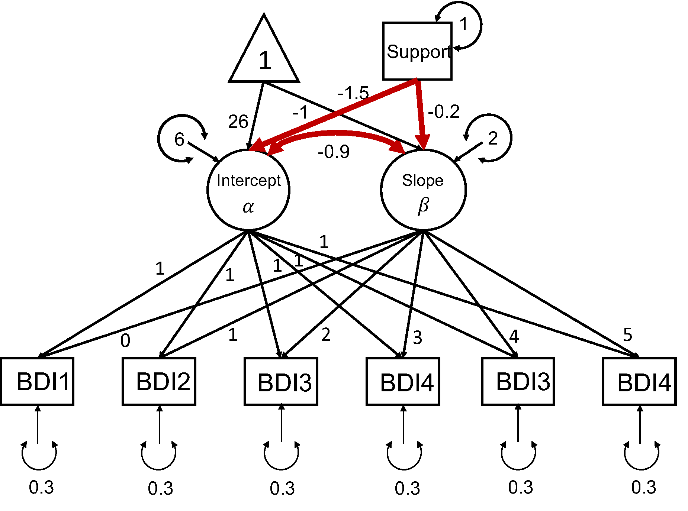

```{r setup, include = FALSE}
knitr::opts_chunk$set(
  collapse = TRUE,
  comment = "#>"
)
```

<!--  -->
In this vignette we will demonstrate how to use `simPM` to search for an optimal PHPM design for a longitudinal research study that employs a conditional linear latent growth model (LGM).

## <span style="color:seagreen">**Research Scenario**</span> 
In this hypothetical scenario, a researcher (Dr. X) is interested in studying the longitudinal growth of adolescents' depressive symptoms. Dr. X has proposed a longitudinal study that is expected to extend over 3 years. Participants are to be assessed with Beck's Depression Inventory (BDI) every six months. Participants also report their social support at the first wave of data collection. The data will be analyzed using a conditional linear LGM, as seen in the following diagram. The main goal of the study is to examine the impact of social support on the growth trajectory of depressive symptoms. Additionally, the researcher is interested in the relation between the intercept and slope after controlling for social support. The model parameters of focal interest include the path coefficients predicting the latent intercept and latent slope from social support, as well as the residual covariance between the latent intercept and slope. 

Very unfortunately, after completing the first two waves of data collection, due to various external reasons the sponsor decides to implement a 30% reduction in funding for remaining three waves. Dr. X wishes to continue the study with a new data collection plan. She decides to use `simPM` to find a design that yields sufficient power but costs no more than the reduced budget.


```{r,out.width='70%', fig.align='center', fig.cap='A linear LGM', echo=FALSE}

```

## <span style="color:seagreen">**Spcify the Population and Analysis Model**</span> 

`simPM` searches for an optimal design based on power analysis using Monte Carlo simulations. To implement power analysis, we first need to supply a population data generating model and an analysis model. The easiest way to specify the population model and analysis model is to use the [`lavaan` model syntax](http://lavaan.ugent.be/tutorial/syntax1.html). For this conditional linear LGM example, the population model is specified as the follows, assuming Dr. X has made an informed decision about the population model and parameter values based on substantive thoery and past research. 

```{r,eval=F}

popModel <- '

sprt ~~ 1*sprt
sprt ~ 0*1

i =~ 1*BDI1 + 1*BDI2 + 1*BDI3 + 1*BDI4 + 1*BDI5 + 1*BDI6
s =~ 0*BDI1 + 1*BDI2 + 2*BDI3 + 3*BDI4 + 4*BDI5 + 5*BDI6

BDI1~0*1
BDI2~0*1
BDI3~0*1
BDI4~0*1
BDI5~0*1
BDI6~0*1

BDI1~~0.3*BDI1
BDI2~~0.3*BDI2
BDI3~~0.3*BDI3
BDI4~~0.3*BDI4
BDI5~~0.3*BDI5
BDI6~~0.3*BDI6

i ~ -1.5*sprt
s ~ -0.2*sprt

i ~ 26*1
s ~ -1*1

i ~~ 6*i+ (-0.9)*s
s ~~ 2*s

'

```

The analysis model is specified as the same conditional linear LGM with freely estimated model parameters:

```{r, eval=F}

analyzeModel <- '

sprt ~~ sprt
sprt ~ 1

i =~ 1*BDI1 + 1*BDI2 + 1*BDI3 + 1*BDI4 + 1*BDI5 + 1*BDI6
s =~ 0*BDI1 + 1*BDI2 + 2*BDI3 + 3*BDI4 + 4*BDI5 + 5*BDI6

BDI1~0*1
BDI2~0*1
BDI3~0*1
BDI4~0*1
BDI5~0*1
BDI6~0*1

BDI1~~BDI1
BDI2~~BDI2
BDI3~~BDI3
BDI4~~BDI4
BDI5~~BDI5
BDI6~~BDI6

i ~ sprt
s ~ sprt

i ~ 1
s ~ 1

i ~~ i + s
s ~~ s

'

```


## <span style="color:seagreen">**Search for an Optimal Wave-level Design**</span> 

We can use the main function `simPM()` to search for an optimal [wave-level missing design](Wave-Level-PHPM.html). For `simPM()` to work properly, we need to supply the relevant information about this longitudinal study. By running the following code, `simPM` will automatically map out all the possible PHPM designs, run power analysis for each plausible design, and output the optimal design.     

```r

wave.lgm=simPM::simPM(popModel = popModel,                          #supply the population model using lavaan language
                      analyzeModel = analyzeModel,                  #supply the analysis model using lavaan language
                      VarNAMES = paste0("BDI",1:6),                 #the observed variable names
                      Time = 6,                                     #total number of waves
                      Time.complete = 2,                            #number of waves completed before funding cut occurs
                      k = 1,                                        #number of observed variables collected at each wave
                      pc = 0.2,                                     #percentage of participants to provide complete data after funding cut
                      pd = 0,                                       #percentage of participants to provide no data after funding cut
                      costmx = c(10,10,15,15),                      #unit cost of each data point at the following waves
                      n = 450,                                      #original sample size
                      nreps = 1000,                                 #number of replications for simulation
                      focal.param = c("i~sprt","s~sprt","i~~s"),    #specify the focal parameters
                      complete.wave = NULL,                         #specify any future wave/variables that need complete data 
                      eval.budget = T,                              #whether or not there is a budget restriction
                      rm.budget = 50*450*0.7,                       #the amount of remaining budget
                      seed = 12345,                                 #random seed
                      distal.var = "sprt",                          #specify any distal variables that are not subject to PM
                      engine = "l",                                 #default, use lavaan to fit the models
                      methods = "wave"                              #type of PHPM designs, "wave" indicates wave-level missing
                      ) 


``` 


More specifically:

* `VarNAMES = paste0("BDI",1:6)`: The observed variables collected in this study are named <span style="color:firebrick">BDI1, BDI2, BDI3, BDI4, BDI5, BDI6</span>. 
* `Time = 6`: The study has <span style="color:firebrick">6</span> waves of data collection in total. 
* `Time.complete = 2`: <span style="color:firebrick">TWO</span> wave of data collection have been completed before funding cut occurs.
* `k = 1`: Only <span style="color:firebrick">one</span> observed variable is collected at each wave.
* `pc = 0.2`: <span style="color:firebrick">Twenty percent</span> of the participants are assigned to provide complete data for future waves after funding cut.
* `pd = 0`: <span style="color:firebrick">Zero percent</span> of the participants are assigned to drop from the study.
* `costmx = c(10,10,15,15)`: The unit cost of one data point is  <span style="color:firebrick">\$10</span> at wave 3 and wave 4, <span style="color:firebrick">\$15</span> at wave 5 and wave 6.
* `n = 450`: The original sample size planned was <span style="color:firebrick">450</span>.
* `nreps = 1000`: The program will run <span style="color:firebrick">1000</span> replications for Monte Carlo simulation (for each plausible design).
* `focal.param = c("i~sprt","s~sprt","i~~s")`: The focal parameters of interest are the path coefficients predicting the latent intercept and slope from social support, as well as the residual covariance between the latent intercept and latent slope.
* `complete.wave = NULL`: No future waves are by design to have complete data from each participant.
* `eval.budget = T`: Yes, there is a budget restriction.
* `rm.budget = 50*450*0.7`: After the funding cut, the researcher will have <span style="color:firebrick"> $\$15,750$ </span> $(=50\times450\times0.7)$ to support the future waves of data collection
* `distal.var = "sprt"`: The social support variable is not subject to repeated measures (and thus not considered for PHPM).
* `engine = "l"`: Model fitted using `lavaan`.
* `methods = "wave"`: Search for wave-level missing designs.


## <span style="color:seagreen">**Summarize the Result**</span> 


```{r, echo=FALSE,message=FALSE,warning=FALSE}
setwd("C:/Users/yifeng94/Desktop/simPM/simPM-git/examples")
load("new_lgm_example.rda")
library(simPM)
```


To [view a summary of the results](Summary.html), we can use the `summary.simpm()` function. It prints out the comparison among all the plausible wave-level missing designs (the comparison is made with regard to the focal parameter who has the lowest empirical power). The function will also print the optimal design that was selected, the details about the focal parameters for the selected optimal design, the missing data pattern for the selected optimal PHPM design, and the proportion as well as the number of participants assigned to each unqie missing data pattern.
```{r,eval=FALSE}
summary(wave.lgm)
``` 

For this example, there are two possible wave-level PHPM designs given the budget constraints. Comparing the two possible designs, an optimal design is selected. The optimal design costs \$9,000, which is below the reduced available budget.

```r
[1] "=================results summary================"
  convergence.rate weakest.param.name weakest.para.power cost.design miss.waves
1            1.000             s~sprt              0.828       13650          2
2            0.999             s~sprt              0.862        9000          3
[1] "=================Optimal design================="
  convergence.rate weakest.param.name weakest.para.power cost.design miss.waves
2            0.999             s~sprt              0.862        9000          3
```

With this design, 20% of the participants are assigned to provide complete data across all the future waves of data collection. The rest 80% of the participants are randomly assigned to one of the four unique missing data patterns ($n=90$ in each pattern). In the pattern matrix, 1 indicates planned missingness and 0 indicates planned complete data. 


```r
[1] "=================Optimal patterns==============="
           BDI1 BDI2 BDI3 BDI4 BDI5 BDI6
              0    0    1    1    1    0
              0    0    1    1    0    1
              0    0    1    0    1    1
              0    0    0    1    1    1
completers    0    0    0    0    0    0
[1] "=================Optimal probs=================="
[1] 0.2 0.2 0.2 0.2 0.2
[1] "=================Optimal ns===================="
[1] 90 90 90 90 90

```
Over 1000 replications, this design yields an empirical power of 1 for testing the path coefficient predicting the latent intercept $b_I$; the statistical power is 0.862 for testing the path coefficient predicting the latent slope $b_S$; the statistical power for testing the residual covariance between latent intercept and latent slope ($\sigma_{IS}$) is 0.999.


```r

[1] "=================Optimal design for focal parameters================="
       Estimate Average Estimate SD Average SE Power (Not equal 0)    Std Est Std Est SD
i~sprt       -1.5001637  0.11853266 0.11738935               1.000 -0.5217401 0.03515221
s~sprt       -0.2015112  0.06651828 0.06750681               0.862 -0.1411624 0.04615719
i~~s         -0.8928260  0.18286992 0.17397815               0.999 -0.2585775 0.04777923
       Std Ave SE Average Param  Average Bias Coverage Average FMI1     SD FMI1
i~sprt 0.03482613          -1.5 -0.0001637438    0.950  0.007683133 0.002622483
s~sprt 0.04674602          -0.2 -0.0015111960    0.956  0.019456644 0.003455831
i~~s   0.04514329          -0.9  0.0071740326    0.937  0.034027477 0.006533191

```

<!--&nbsp;-->

To view more details of the optimal PHPM design, we can use the following code, which will give us more detailed information about the simulation results for this selected PHPM design. 

```{r,eval=FALSE}
summary(wave.lgm$opt.output)
```


## <span style="color:seagreen">**Visualize the Optimal Design**</span> 

To [visualize the missing data patterns of the optimal PHPM design](PlotPM.html), we can use the `plotPM()` function. It will plot the missing data pattern matrix so people can have a more intuitive understanding of the optimal design that was selected. In this plot, each row represents a unique missing data pattern. Each column represents an observed variable. The number of participants assigned to each missing data pattern is also labeled. 

In this example, we can see that 90 participants are assigned to provide complete data over the future waves of data collection, while the rest of the participants are randomly assigned to one of the four missing data patterns. For instance, there are 90 participants who are randomly picked to NOT provide data in wave 3, wave 4, and wave 5 (the first row of the plot); Another 90 participants are randomly picked to NOT provide data in wave 3, wave 4, and wave 6 (the second row of the plot). 

```{r,fig.width=7,fig.height=4}
plotPM(wave.lgm)
```
