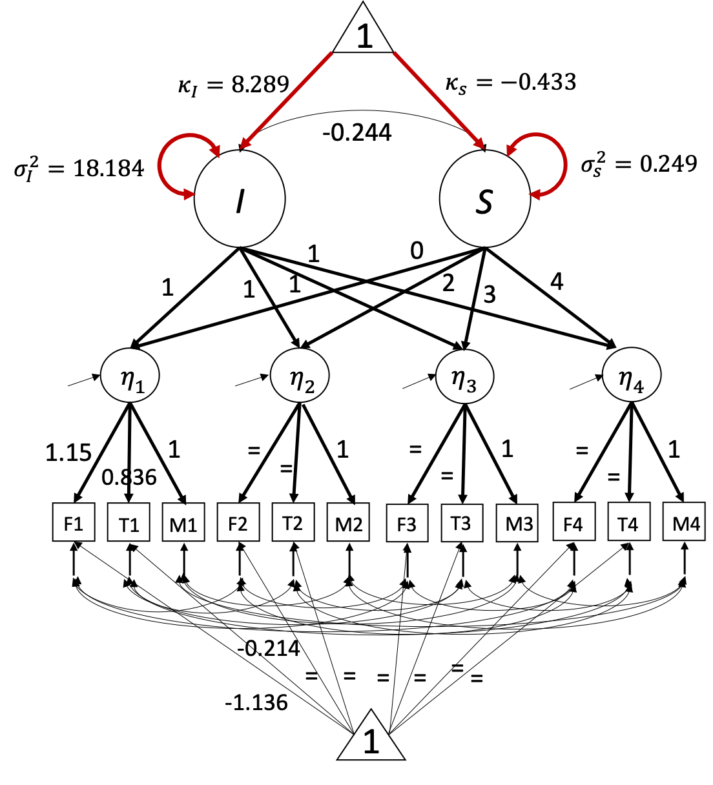

```{r setup, include = FALSE}
knitr::opts_chunk$set(
  collapse = TRUE,
  comment = "#>"
)
```

## <span style="color:seagreen">**Introduction**</span>

In this vignette we will discuss how to use `simPM` to search for item-level PHPM designs via *forward assembly*. Similar with [balanced item-level PHPM designs](Item-Level-PHPM.html), the missingness is imposed at the item(or observed variable) level. But unlike the balanced designs, the number of missing observed measurements is not equal across all the missing data patterns. For example, some participants may be missing only one observed measurement in the remaining waves, while some participants may be assigned to miss four observed measurement in the remaining waves. 

In `simPM`, the forward assembly methods will build up the PHPM design sequentially. It will start by searching for the optimal missing data pattern with only one missing observed measurement. Given the optimal pattern with only one missing indicator, it continues to build the design by adding another pattern with two missing observed measurements, after which it continue to add another missing data pattern with three missing observed measurements...At each step, it looks for the optimal missing data pattern that would yield the best statistical power, in combination with the previously selected missing data patterns. 


Compared to balanced item-level PHPM designs, the designs returned by forward assembly will have much fewer number of unique missing data patterns and thus make it easier for implementation in practice.


## <span style="color:seagreen">**Search for item-level PHPM designs via forward assembly**</span>

To implement forward assembly using `simPM`, we need to specify the `methods = "forward"` argument when using the `simPM()` function. Additionally, we also need to specify the maximum number of unique missing data patterns we would wish to have in the PHPM design using the `max.mk` argument. 


## <span style="color:seagreen">**Example**</span>

In this [hypothetical example](Second-Order-Latent-Growth-Model.html), a researcher (Mr. Y) is interested in studying the longitudinal trajectories of children's externalizing behaviors. The researcher proposed to collect reports from the mother, the father, and the teacher about the child's daily behaviors (from families with hetero-sexual parents). Once the data collection is completed, the researcher intends to model the externalizing behaviors as a latent variable and investigate its change over time. 

Suppose the researcher has proposed a complete-case longitudinal study to collect data for 1,135 children across four waves, each collected at grades 1, 3, 4, and 5. The proposed analysis model is shown below, where the three indicators of the latent construct (externalizing behavior) $\eta$ across each of the four waves are the responses from the mother (*M1*-*M4*), the father (*F1*-*F4*), and the teacher (*T1*-*T4*), correspondingly.

Although the researcher has initially obtained an external funding to support his longitudinal study, unfortunately, after the first wave of data collection, the funding agency announces a 30% reduction in the remaining funding. Mr. Y wishes to continue the project but he has to deal with the lowered budget constraint. Of course, Mr. Y also wants to keep the scientific rigor and satisfactory statistical power. He thus chooses to use `simPM` to find a design that yields sufficient power but costs no more than the reduced budget. 

```{r,out.width='50%', fig.align='center', fig.cap='A second-order linear LGM', echo=FALSE}

```


After supplying the population model and the analysis model, we can use the `simPM()` function to search for an optimal item-level missing design with the `methods = "forward"` argument. For this example, suppose we wish to have no more than five unique missing data patterns in the PHPM design. For more details about the specification of other arguments, please refer to [this vignette](Second-Order-Latent-Growth-Model.html).  

```{r,eval=F}
popModel='
EXB1=~1.150*F1+0.836*T1+1*M1
EXB2=~1.150*F2+0.836*T2+1*M2
EXB3=~1.150*F3+0.836*T3+1*M3
EXB4=~1.150*F4+0.836*T4+1*M4


interc=~1*EXB1+1*EXB2+1*EXB3+1*EXB4
slope=~0*EXB1+2*EXB2+3*EXB3+4*EXB4

interc~~-0.244*slope

interc~8.289*1
slope~-0.433*1

interc~~18.184*interc
slope~~0.249*slope

EXB1~~1.084*EXB1
EXB2~~1.777*EXB2
EXB3~~1.457*EXB3
EXB4~~1.700*EXB4

T1~-0.214*1
T2~-0.214*1
T3~-0.214*1
T4~-0.214*1

M1~0*1
M2~0*1
M3~0*1
M4~0*1

F1~-1.136*1
F2~-1.136*1
F3~-1.136*1
F4~-1.136*1


M1~~23.886*M1
F1~~17.737*F1
T1~~55.074*T1 
M2~~20.223*M2      
F2~~8.941*F2      
T2~~66.698*T2      
M3~~16.905*M3      
F3~~13.922*F3      
T3~~61.995*T3 
M4~~19.324*M4 
F4~~13.410*F4      
T4~~71.127*T4

F1~~4.256*F2+7.040*F3+5.737*F4
F2~~5.440*F3+3.590*F4
F3~~6.165*F4

T1~~23.603*T2+24.666*T3+23.168*T4
T2~~35.213*T3+29.648*T4
T3~~33.815*T4

M1~~12.975*M2+11.153*M3+11.683*M4
M2~~12.219*M3+11.332*M4
M3~~11.807*M4

'
```


```{r, eval=F}
analyzeModel='

EXB1=~NA*F1+a*F1+b*T1+1*M1
EXB2=~NA*F2+a*F2+b*T2+1*M2
EXB3=~NA*F3+a*F3+b*T3+1*M3
EXB4=~NA*F4+a*F4+b*T4+1*M4

interc=~1*EXB1+1*EXB2+1*EXB3+1*EXB4
slope=~0*EXB1+2*EXB2+3*EXB3+4*EXB4

interc~~slope

interc~1
slope~1
interc~~interc
slope~~slope

EXB1~~EXB1
EXB2~~EXB2
EXB3~~EXB3
EXB4~~EXB4

F1~c*1
F2~c*1
F3~c*1
F4~c*1

T1~d*1
T2~d*1
T3~d*1
T4~d*1

M1~0*1
M2~0*1
M3~0*1
M4~0*1

F1~~F1
F2~~F2
F3~~F3
F4~~F4

T1~~T1
T2~~T2
T3~~T3
T4~~T4

M1~~M1
M2~~M2
M3~~M3
M4~~M4

F1~~F2+F3+F4
F2~~F3+F4
F3~~F4

T1~~T2+T3+T4
T2~~T3+T4
T3~~T4

M1~~M2+M3+M4
M2~~M3+M4
M3~~M4
'

```


```r
forward.ex2 <- simPM(
  analyzeModel = analyzeModel,
  popModel = popModel,
  VarNAMES = c("F1","T1","M1","F2","T2","M2",
               "F3","T3","M3","F4","T4","M4"),
  distal.var = NULL,
  n = 1135,
  nreps = 1000,
  seed = 123321,
  Time = 4,
  k = 3,
  Time.complete = 1,
  costmx = c(rep(5,3),rep(10,3),rep(15,3)),  
  pc = 0.05,   
  pd = 0,
  focal.param = c("interc~1",
                  "slope~1",
                  "interc~~interc",
                  "slope~~slope"),
  max.mk = 5,                                      #maximum number of unique missing data patterns allowed in the design
  eval.budget = T,            
  rm.budget = 1135*(15+30+45)*0.7,          
  complete.var = "M3",                             #assume the researcher wants to collect complete data from the mothers at wave 3
  engine = "l",
  methods = "forward"                              #type of PHPM designs under consideration, "forward" indicates imbalanced item-level PM designs searched via forward assembly.
)

```

```{r, echo = FALSE, message = FALSE, warning = FALSE}
setwd("C:/Users/yifeng94/Desktop/simPM/simPM-git/examples")
load("item.ex2_r1.rda")
library(simPM)
```


In this example, given that we have specified to collect complete data for the mother's report at wave 3, we thus have:

* ${8 \choose 1}=8$ possible patterns with $1$ missing observed measurement.
* ${8 \choose 2}=28$ possible patterns with $2$ missing observed measurements.
* ${8 \choose 3}=56$ possible patterns with $3$ missing observed measurements.
* ${8 \choose 4}=70$ possible patterns with $4$ missing observed measurements.
* ${8 \choose 5}=56$ possible patterns with $5$ missing observed measurements.


The program will run Monte Carlo simulations in order to assemble the optimal PHPM design. With the `max.mk = 5` argument, the target PHPM design will have five unique missing data patterns, each has $1, 2, ..., 5$ missing observed measurements, respectively.

According to the output, the optimal design costs \$61,830, which is below the reduced available budget. From the output, we can see that 10% of the participants are assigned to provide complete data across all the future waves of data collection. The rest 90% of the participants are randomly assigned to one of the 126 unique missing data patterns ($n=8$ in each pattern). In each missing data pattern, the participants are assigned to miss four observed indicators (items) in the future waves of data collection (e.g., father and mother report at wave 2 as well as father and teacher report at wave 3). 

Over 1000 replications, this design yields an empirical power of 1 for testing the mean intercept (`interc~1`), the mean slope (`slope~1`), and the intercept variance (`interc~~interc`). The empirical statistical power for testing the slope variance (`slope~~slope`) is 0.79.   


```{r}
summary(item.ex2)
``` 

```{r,fig.width=7,fig.height=4}
plotPM(item.ex2, row.names=F)
```


