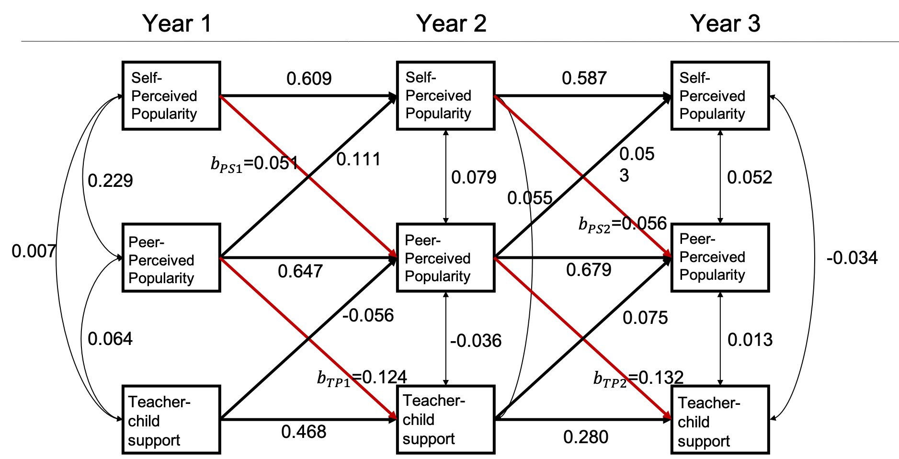

```{r setup, include = FALSE}
knitr::opts_chunk$set(
  collapse = TRUE,
  comment = "#>"
)
```

## <span style="color:seagreen">**Introduction**</span>

In this vignette we will discuss how to use `simPM` to search for item-level PHPM designs via *forward assembly*. Similar with [balanced item-level PHPM designs](Item-Level-PHPM.html), the missingness is imposed at the item(or observed variable) level. But unlike the balanced designs, the number of missing observed measurements is not equal across all the missing data patterns. For example, some participants may be missing only one observed measurement in the remaining waves, while some participants may be assigned to miss four observed measurement in the remaining waves. 

In `simPM`, the forward assembly methods will build up the PHPM design sequentially. It will start by searching for the optimal missing data pattern with only one missing observed measurement. Given the optimal pattern with only one missing indicator, it continues to build the design by adding another pattern with two missing observed measurements, after which it continue to add another missing data pattern with three missing observed measurements...At each step, it looks for the optimal missing data pattern that would yield the best statistical power, in combination with the previously selected missing data patterns. 


Compared to balanced item-level PHPM designs, the designs returned by forward assembly will have much fewer number of unique missing data patterns and thus make it easier for implementation in practice.


## <span style="color:seagreen">**Search for item-level PHPM designs via forward assembly**</span>

To implement forward assembly using `simPM`, we need to specify the `methods = "forward"` argument when using the `simPM()` function. Additionally, we also need to specify the maximum number of unique missing data patterns we would wish to have in the PHPM design using the `max.mk` argument. 


## <span style="color:seagreen">**Example**</span>


In this [hypothetical example](Autoregressive-Cross-Lagged-Model.html), Suppose a group of researchers is interested in examining the longitudinal reciprocal relations between peer relationships and teacher-child relationships. They have been funded for a longitudinal panel study following 1000 children for three years. Each year they would collect data on three measures: two measures of peer relationships (self-perceived popularity and peer-perceived popularity) and one measure of teacher-child relationships (teacher-child support). Upon the completion of data collection, they plan to fit an autoregressive cross-lagged model shown below. The parameter of focal interest to the researchers are the cross-lagged path coefficients predicting the peer-perceived popularity from the self-perceived popularity measured at the previous time point, as well as in the cross-lagged paths predicting teacher-child support from the peer-perceived popularity measured at the previous time point (marked in red). 

Unfortunately, after the first wave of data collection, the funding agency announces a 30% reduction in the remaining funding. The researcher wishes to continue the project under the budget constraint, with the hope to not compromise the scientific rigor and statistical power. The reseacher thus decideds to use `simPM` to find a design that yields sufficient power but costs no more than the reduced budget. 


```{r,out.width='80%', fig.align='center', fig.cap='An autoregressive and cross-lagged model', echo=FALSE}

```

After supplying the population model and the analysis model, we can use the `simPM()` function to search for an optimal item-level missing design with the `methods = "forward"` argument. For this example, suppose we wish to have no more than three unique missing data patterns in the PHPM design. For more details about the specification of other arguments, please refer to [this vignette](Autoregressive-Cross-Lagged-Model.html).   


```{r,eval=F}

popModel <- '

#----------- path coefficients ------------#

SelfPop2~0.609*SelfPop1+0.111*PeerPop1
SelfPop3~0.587*SelfPop2+0.053*PeerPop2

PeerPop2~0.051*SelfPop1+0.647*PeerPop1+(-0.056)*Support1
PeerPop3~0.056*SelfPop2+0.679*PeerPop2+0.075*Support2

Support2~0.468*Support1+0.124*PeerPop1
Support3~0.280*Support2+0.132*PeerPop2

#----------- residual covariance ----------#

PeerPop1~~0.229*SelfPop1+0.064*Support1
SelfPop1~~0.007*Support1

PeerPop2~~0.079*SelfPop2+(-0.036)*Support2
SelfPop2~~0.055*Support2

PeerPop3~~0.052*SelfPop3+0.013*Support3
SelfPop3~~(-0.034)*Support3

#---------------- means -------------------#

PeerPop1~3.273*1
SelfPop1~0.048*1
Support1~2.905*1

PeerPop2~1.247*1
SelfPop2~(-0.343)*1
Support2~1.193*1

PeerPop3~0.814*1
SelfPop3~(-0.161)*1
Support3~1.451*1

#--------------- variances ----------------#

PeerPop1~~0.447*PeerPop1
SelfPop1~~1.010*SelfPop1
Support1~~0.540*Support1

PeerPop2~~0.238*PeerPop2
SelfPop2~~0.607*SelfPop2
Support2~~0.432*Support2

PeerPop3~~0.211*PeerPop3
SelfPop3~~0.380*SelfPop3
Support3~~0.424*Support3

'

```


```{r, eval=F}
analyzeModel <- '

#----------- path coefficients ------------#

SelfPop2~SelfPop1+PeerPop1
SelfPop3~SelfPop2+PeerPop2

PeerPop2~SelfPop1+PeerPop1+Support1
PeerPop3~SelfPop2+PeerPop2+Support2

Support2~Support1+PeerPop1
Support3~Support2+PeerPop2

#----------- residual covariance ----------#

PeerPop1~~SelfPop1+Support1
SelfPop1~~Support1

PeerPop2~~SelfPop2+Support2
SelfPop2~~Support2

PeerPop3~~SelfPop3+Support3
SelfPop3~~Support3


#---------------- means -------------------#

PeerPop1~1
SelfPop1~1
Support1~1

PeerPop2~1
SelfPop2~1
Support2~1

PeerPop3~1
SelfPop3~1
Support3~1


#--------------- variances ----------------#

PeerPop1~~PeerPop1
SelfPop1~~SelfPop1
Support1~~Support1

PeerPop2~~PeerPop2
SelfPop2~~SelfPop2
Support2~~Support2

PeerPop3~~PeerPop3
SelfPop3~~SelfPop3
Support3~~Support3

'


```


```r
forward.ex3 <- simPM(
  popModel,
  analyzeModel,
  VarNAMES=c("PeerPop1","SelfPop1","Support1","PeerPop2","SelfPop2","Support2","PeerPop3","SelfPop3","Support3"),
  distal.var = NULL,
  n=10,
  nreps=1000,
  seed=12345,
  Time=3,
  k=3,
  max.mk=3, 
  Time.complete=1,
  costmx=c(5,5,5,10,10,10), 
  pc=0.1,
  pd=0,
  focal.param=c("PeerPop2~SelfPop1","Support2~PeerPop1","PeerPop3~SelfPop2","Support3~PeerPop2"),
  eval.budget=T,          
  rm.budget=31500L,        
  complete.var=NULL,
  engine="l",
  methods="forward"
)

```

```{r, echo = FALSE, message = FALSE, warning = FALSE}
setwd("C:/Users/yifeng94/Desktop/simPM/simPM-git/examples")
load("forward.ex3_r1.rda")
library(simPM)
```


In this example, we have:

* ${6 \choose 1}=6$ possible patterns with $1$ missing observed measurement.
* ${6 \choose 2}=15$ possible patterns with $2$ missing observed measurements.
* ${6 \choose 3}=20$ possible patterns with $3$ missing observed measurements.
* ${6 \choose 4}=15$ possible patterns with $4$ missing observed measurements.
* ${6 \choose 5}=6$ possible patterns with $5$ missing observed measurements.


The program will run Monte Carlo simulations in order to assemble the optimal PHPM design. With the `max.mk = 3` argument, the target PHPM design will have five unique missing data patterns, each has $1, 2, 3$ missing observed measurements, respectively.

According to the output, the optimal design costs \$30,000, which is below the reduced available budget. From the output, we can see that 10% of the participants are assigned to provide complete data across all the future waves of data collection. The rest 90% of the participants are randomly assigned to one of the three unique missing data patterns ($n=300$ in each pattern). 

Over 1000 replications, this design yields an empirical power of 0.885 for testing the path coefficient $b_{PS_1}$, 0.914 for testing the path coefficient $b_{PS_2}$, 0.906 for testing the path coefficient $b_{TS_1}$, and 0.937 for testing the path coefficient $b_{TS_2}$. With this PHPM design, the statistical power is satisfactory for testing each of the focal parameters.


```{r}
summary(forward.ex3)
``` 

```{r,fig.width=9,fig.height=5}
plotPM(forward.ex3, row.names=F)

```


